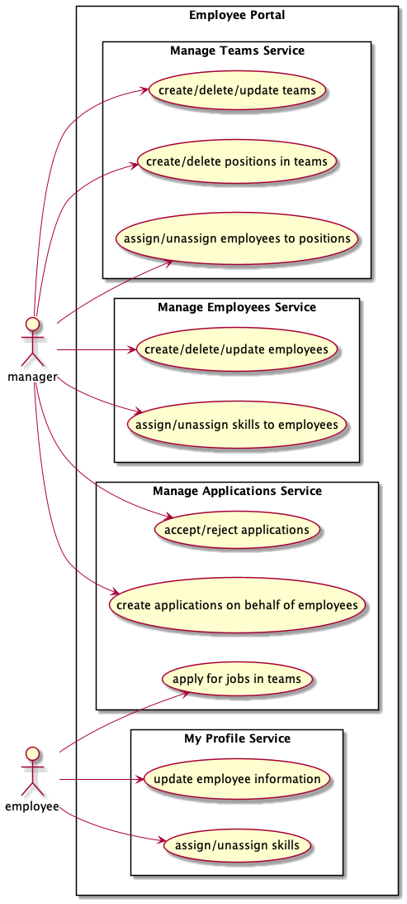
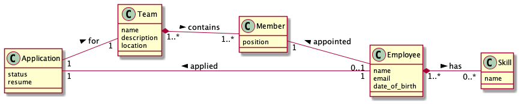

# Employee Management

A sample Employee Management Portal based on SAP's [CAP framework](https://cap.cloud.sap/docs/about/). 

This project supports *single-tenancy* (on local via *H2 Database* or on cloud via *SAP HANA*) as well as *multi-tenancy* (only on Cloud in SAP HANA via [CAP's multitenancy support](https://cap.cloud.sap/docs/java/multitenancy)) in [SAP Cloud Platform](https://www.sap.com/products/business-technology-platform.html).


*Demo of Employee Management - CAP application. Sample data shown are fictitious*

## Documentation

### 1. Use-cases

There are 2 types of users - `manager` & `employee`, with set permissions to do particular actions



### 2. Domain Modelling



### 3. Services

| Service | Allowed Roles | Description |
|---------|---------------|-------------|
| [`manage-team-service`](./srv/manage-team-service.cds) | `manager` | Create, Update & Delete teams. Also create new positions (members) in a Team and assign Employees |
| [`manage-employee-service`](./srv/manage-employee-service.cds)| `manager` | Create, Update & Delete Employees. Also create, update, delete Skills which Employees may have |
| [`manage-application-service`](./srv/manage-application-service.cds) | `manager` & `authenticated-user` | For Managers - Create, Update & Delete applications as well as Accept/Reject applications created by Employees For Employees - Create (Apply for a Job) applications for various Teams and add in a Resume as plain-text |
| [`my-profile-service`](./srv/my-profile-service.cds) | `authenticated-user` | Personal Employee details, if the `authenticated-user` has one and optionally add/delete Skills and update DOB |

## Build & Run

### Prerequisites

* Java 11 or higher (via [SDKMAN!](https://sdkman.io/) preferred)

* Maven 3.5 or higher

* CDS ([install](https://cap.cloud.sap/docs/get-started/#local-setup))

### Build

1. Run *Maven* to compile the project

        mvn clean package

### Run locally

1. Run the Spring Boot application

    a. Use 'Run' in VS-Code and select 'Debug (Launch)-Application<employee-management>' task to launch the application (Recommended)
    
    *or* 

    b. Execute the command in a terminal. The `-P cdsdk-global` activates the profile to skip the installation of CDS SDK for every build.
    
    ```sh
    mvn spring-boot:run -P cdsdk-global
    ```

> _Note_: If the compilation fails with `Executable npx not found` error, make sure to delete the `node_modules/` folder from the root of the project.

2. The oData API is available at https://localhost:8080

3. The UI is available at https://localhost:8080/fiori.html

### Run on Cloud

#### 1. Multi-Target Apps (MTA) Method

##### Prerequisites

* Cloud MTA Builder Tool ([Install](https://sap.github.io/cloud-mta-build-tool/download/))

* Cloud Foundry CLI ([Install](https://docs.cloudfoundry.org/cf-cli/install-go-cli.html))

* Cloud Multiapps CF CLI Plugin ([Install](https://github.com/cloudfoundry-incubator/multiapps-cli-plugin))

* Cloud Foundry CLI logged into the SAP Cloud Foundry account ([Step 1 of tutorial](https://developers.sap.com/tutorials/s4sdk-cloud-foundry-sample-application.html#34579dba-f2c5-48ad-b026-04c40dc269d1))

##### Build & Deploy in the Cloud Foundry

> The _Cloud MTA Builder Tool_ doesn't support custom `mta.yaml` filenames [SAP/cloud-mta-build-tool#709](https://github.com/SAP/cloud-mta-build-tool/issues/709). For multi-tenant deployments, rename `mta-multitenant.yaml` to `mta.yaml` & `cds-security-multitenant.json` to `cds-security.json`

1. Build the MTAR package. Once built, you can find a package named `employee-management_x.y.z.mtar` under *mta_archives/* folder

        mbt build

2. Push the MTAR package and deploy in the Cloud Foundry

        cf deploy mta_archives/employee-management_x.y.z.mtar

## Extending the SaaS application

After subscribing to the application in a separate Sub-account, assign yourself the `Extension_Developer` & `Extension_Admin` roles.

Execute the following to create an extension project in your local

    cds extend https://<DEPLOYED_SUB_ACCOUNT>-<DEPLOYED_SPACE>-employee-management-sidecar.cfapps.sap.hana.ondemand.com/ -d <PROJECT_NAME> -s <SUBSCRIBED_SUB_ACCOUNT>

While logging in, a *passcode* may be asked (if your account is protected by MFA), for which a passcode can be created from `https://<SUBSCRIBED_SUB_ACCOUNT>.authentication.sap.hana.ondemand.com/passcode`. Once authenticated, an extension project will be created locally.

Once created, you can push the changes to your subscribed tenant and activate it by executing the following command

    cds activate --to https://<DEPLOYED_SUB_ACCOUNT>-<DEPLOYED_SPACE>-employee-management-sidecar.cfapps.sap.hana.ondemand.com/ -s <SUBSCRIBED_SUB_ACCOUNT>

More details on SaaS Extensions [here](https://cap.cloud.sap/docs/guides/extensibility).

## License

```txt
MIT License

Copyright (c) 2020 Merbin J Anselm

Permission is hereby granted, free of charge, to any person obtaining a copy
of this software and associated documentation files (the "Software"), to deal
in the Software without restriction, including without limitation the rights
to use, copy, modify, merge, publish, distribute, sublicense, and/or sell
copies of the Software, and to permit persons to whom the Software is
furnished to do so, subject to the following conditions:

The above copyright notice and this permission notice shall be included in all
copies or substantial portions of the Software.

THE SOFTWARE IS PROVIDED "AS IS", WITHOUT WARRANTY OF ANY KIND, EXPRESS OR
IMPLIED, INCLUDING BUT NOT LIMITED TO THE WARRANTIES OF MERCHANTABILITY,
FITNESS FOR A PARTICULAR PURPOSE AND NONINFRINGEMENT. IN NO EVENT SHALL THE
AUTHORS OR COPYRIGHT HOLDERS BE LIABLE FOR ANY CLAIM, DAMAGES OR OTHER
LIABILITY, WHETHER IN AN ACTION OF CONTRACT, TORT OR OTHERWISE, ARISING FROM,
OUT OF OR IN CONNECTION WITH THE SOFTWARE OR THE USE OR OTHER DEALINGS IN THE
SOFTWARE.
```